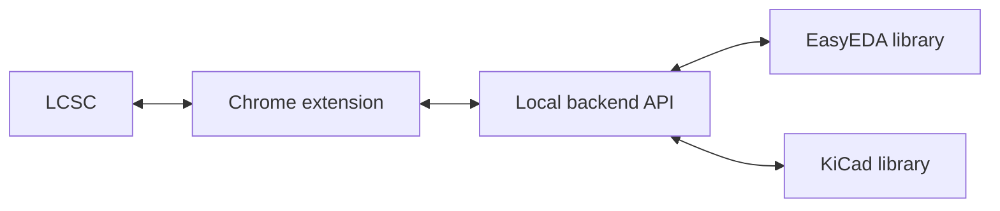

# KiCad Parts Importer

This repo includes a Chrome extension that adds buttons on [lcsc.com](https://www.lcsc.com/) to import components directly into a selected KiCad library. The extension calls a local backend that uses easyeda2kicad to download symbol, footprint, and 3D model data from the EasyEDA library (when available). The backend is required because the extension cannot modify your filesystem or run CLI tools on its own.

> [!WARNING]
> EasyEDA source data can contain issues. ALWAYS CHECK PINS AND FOOTPRINTS before using converted parts in production designs.

  

## What is included
- `easyeda2kicad/`: Python conversion engine and backend modules.
- `run_server.py`: FastAPI backend for the extension.
- `chrome_extension/`: Chrome MV3 extension UI that talks to the local backend.

## Quick start
1. Install the extension:
   - Chrome Web Store: [KiCad Parts Importer](https://chromewebstore.google.com/detail/ojkpgmndjlkghmaccanfophkcngdkpmi)
   - Or load locally: open `chrome://extensions`, enable Developer mode, click "Load unpacked", select `chrome_extension/`.
2. Download the backend from the [Releases](https://github.com/theautomatist/LCSC2KiCad/releases) page and start it:
   - macOS/Linux: `chmod +x "./<version>-KiCad Parts Importer-<OS>"` then `./"<version>-KiCad Parts Importer-<OS>"`
   - macOS Gatekeeper: `xattr -dr com.apple.quarantine "./<version>-KiCad Parts Importer-Mac"`
   - Windows: run `"<version>-KiCad Parts Importer-Windows.exe"`
3. Browse `https://www.lcsc.com/` and use the extension to export components.

## UI and LCSC Website Integration
| Extension settings | Library management |
| --- | --- |
|  | |
| Configure backend URL, overwrite defaults, and project-relative paths. |View existing libraries, counts, and status badges. |

| Add a library |Fetch new parts |
| --- |--- |
|  |  |
| Create a new library and choose output folders. |Request symbols, footprints, and 3D models from LCSC IDs. |

| LCSC part page action |
| --- |
|  |
| Download a single part directly from the product page. |

| LCSC part downloaded |
| --- |
|  |
| Confirms the part is available in the library. |

| LCSC list actions |
| --- |
|  |
| Quick download buttons added to LCSC listing pages. |

## Project layout
- `easyeda2kicad/api/`: FastAPI server routes.
- `easyeda2kicad/easyeda/`: EasyEDA parsing and fetching.
- `easyeda2kicad/kicad/`: KiCad export logic.
- `easyeda2kicad/service/`: Conversion orchestration.
- `tests/`: API and conversion tests.

> [!NOTE]
> This repo includes fixes for several EasyEDA conversion edge cases and improves overall stability when exporting libraries.

## Credits
This project builds on the original [easyeda2kicad](https://github.com/uPesy/easyeda2kicad.py) work by uPesy

## License

> [!NOTE]
> This repository includes code from the original AGPL-3.0 project, so the AGPL-3.0 license applies to that code. My intent for new contributions is "free to use, non-commercial only"; this note does not change the licensing of the original code.
> 
AGPL-3.0. See `LICENSE`.
